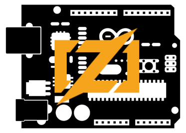

  

    <em>ZigZag OS, leveraging Zig powers for embedded operational systems</em>

# ZigZag OS

ZigZag is an operational system for embedded systems written in Zig

## Game dev HW ideas

* ​​esp32s3
* M5stack esp32 basic m5
* Placa T-Display S3 ESP32-S3 - LILYGO
* https://shop.m5stack.com/products/atom-joystick-with-m5atoms3?variant=45470405492993
* https://www.casadarobotica.com/placas-embarcadas/arduino/shield/joystick-shield-para-arduino-v1-a
* https://www.casadarobotica.com/ver-mais/display-lcd-nokia-5110-para-arduino
* https://www.ti.com/tool/BOOSTXL-EDUMKII#description
* https://pt.aliexpress.com/item/4000078393153.html?spm=a2g0o.productlist.main.1.5de3tGNQtGNQoQ&algo_pvid=a8125161-40f0-4dc2-b527-72955d749cc2&utparam-url=scene%3Asearch%7Cquery_from%3A wermos D1 R3
* makerfabs.com/esplay-micro-v2.html
* https://pt.aliexpress.com/item/1005004506118365.html
* https://www.eletrogate.com/display-tft-lcd-1.3-spi-rgb-240x240-st7789?utm_content=&utm_term=&gad_source=1

ESP32 with TFT+Joystick+breadboard is a good idea, later we can make a shield for it.

* https://wiki.sipeed.com/hardware/en/lichee/RV/Dock.html
* https://pt.aliexpress.com/item/1005005603677106.html